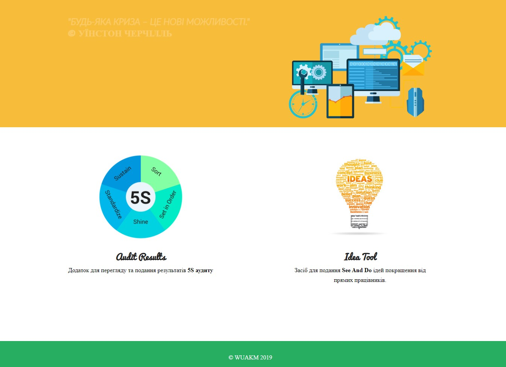
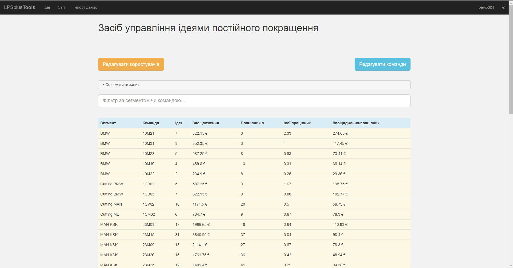
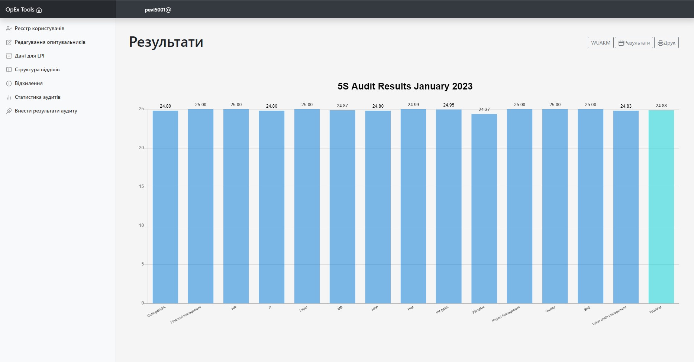

Hello, here is my very first and second projects. Both of them is developed for automotive industry.
 
Both projects are actively used at Leoni Ukraine as Opex applications

 
The projects requirements:
- Apache web server v2.4.x
- Apache module mod_auth_sspi (for users authentication)
- PHP at least v5.6
- MYSQL v5.5 or higher
